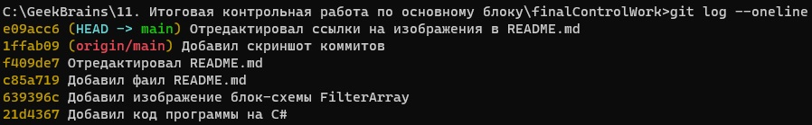

# Итоговая контрольная работа по основному блоку

### Задание
```sh
1. Создать репозиторий на GitHub
2. Нарисовать блок-схему алгоритма (можно обойтись блок-схемой основной содержательной  части, если вы выделяете её в отдельный метод)
3. Снабдить репозиторий оформленным текстовым описанием решения (файл README.md)
4. Написать программу, решающую поставленную задачу
5. Использовать контроль версий в работе над этим небольшим проектом (не должно быть так, что всё залито одним коммитом, как минимум этапы 2, 3, и 4 должны быть расположены в разных коммитах)

Задача: Написать программу, которая из имеющегося массива строк формирует новый массив из строк, длина которых меньше, либо равна 3 символам. Первоначальный массив можно ввести с клавиатуры, либо задать на старте выполнения алгоритма. При решении не рекомендуется пользоваться коллекциями, лучше обойтись исключительно массивами.

Примеры:
[“Hello”, “2”, “world”, “:-)”] → [“2”, “:-)”]
[“1234”, “1567”, “-2”, “computer science”] → [“-2”]
[“Russia”, “Denmark”, “Kazan”] → []
```

### Решение

1. Если вы читаете этот текст, то вы находитесь в удалённом репозитории на GitHub.
2. Блок-схема основной функции FilterArray: 

    

    [Блок-схема FilterArray](https://github.com "Нажмите для перехода на блок-схему")

3. Фаил README.md вы сейчас читаете.
4. Программа которую я написал для решения этой задачи состоит из трёх функций и переменной:
    * size - пременная которая принимает в себя целое число, ввод с консоли. Необходима для определения длинны массива который будет создавать функция CreateArray.
    * CreateArray - функция принимает в себя целое число которое определяет длинну создаваемого в ней массива. Далее с помощь цикла for запрашивает у пользователя ввод с консоли и присваивает этот ввод элементу массива. После того как пользователь заполнил все элемены, возвращает массив из этих элементов.
    * ShowArray - функция которая принимает в себя строковый массив и отображет все его элементы в консоли с помощью цикла for.
    * FilterArray - функция которая принимает в себя строковый массив и переменную maxLength которая служит для определения максимальной длинны элемента массива который она создаст (в нашем случае это число 3). Далее вычисляет длинну нового массива спомощью цикла for и условия в этом цикле, что длинна элемента входящего массива меньше либо равна maxLength. 
    После этого создаёт новый массив и добавляет новую переменную count как счётчик для того что бы в следующем цикле for c таким же условием как и в предыдущем цикле, присваивать значение элемента входящего массива элементу нового массива. Возвращает данная функция уже новый массив, длинна элементов которого не привышает maxLength.
5. Коммиты: 

    

    [Скриншот коммитов](https://github.com "Нажмите для перехода на скриншот коммитов")
    

